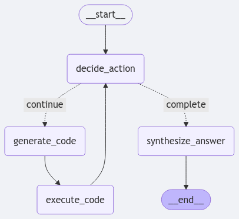

# LangGraph Code Generator

A simple implementation that uses LangGraph to generate and run Python code step by step. It demonstrates how to use LangGraph's workflow to break down a programming task into smaller steps of code generation, execution, and validation.

## Quick Start

1. Install dependencies:
```bash
pip install -r requirements.txt
```

2. Set up environment:
```bash
export OPENAI_API_KEY="your-api-key"
# Optional: Custom OpenAI endpoint
export OPENAI_BASE_URL="your-endpoint"
```

3. Run with your programming task:
```bash
python langgraph_code_executor.py "What is the 105th prime number?"
```

## How It Works

The implementation uses a basic graph-based approach with the following steps:



The workflow consists of four main nodes:
- **Decision Node**: Checks if the goal has been achieved
- **Code Generation**: Generates Python code for the current step
- **Execution**: Runs the generated code
- **Answer Synthesis**: Formats the final output

The code generator will break down the task into steps, generate appropriate Python code, and execute it until the goal is achieved. Check out `langgraph_code_executor.py` to see how it works.